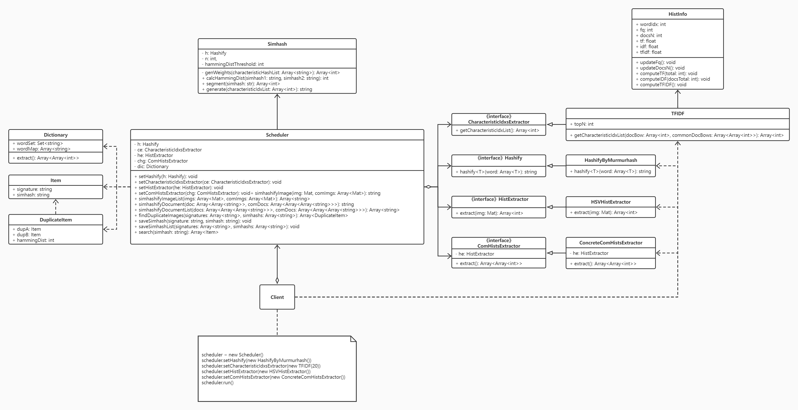

# Simhash

Simhash is an algorithm for extracting document fingerprints, which can evaluate the similarity of two documents by calculating the Hamming Distance between the simhash values of them.

I extended simhash to add the function of processing images.

By comparing the similarity between images, you can implement the functions of image deduplication, image search and so on.

## Purpose

When we work with images, we tend to use deep learning methods, but algorithm engineers and computing resources are expensive.

So, if your business wants to add image search to the search engine of your application, simhash will be a good choice.

## Installation

## Introduction

Using Simhash to customized yourself application.

Using Scheduler to call some encapsulated functions like image-deduper, image-search, extract simhash for image and document.

Using CorpusReader to read documents and load trie of stopwords.

Using Dictionary to convert a document to word bag vector.

## API

### Simhash

Pure simhash, not coupled with any dependencies.

__init__(hashify: Callable, n: int, hamming_dist_threshold: int):

    hashify(word: Optional[Union[str, int]]) -> str: A customizable callback function to specify the hash algorithm.
    n: Specifies how many bits of simhash value to generate, it should be the same as the number of hash strings generated by hashify.
    hamming_dist_threshold: Specify a similarity threshold.

generate(characteristic_idx_list: List[int]) -> str:

    characteristic_idx_list: The index(image hist or document bag vector) that best reflects the characteristics of documents or images.
    return: simhash value

calc_hamming_dist(simhash1: str, simhash2: str) -> int:

    Calculate Hamming distance between two simhash.

segment(simhash: str) -> List[str]:

    Divide the simhash value into n segments.
    n = hamming_dist_threshold

### ComHistsGetter

Common hist is required for handle image when CharacteristicIdxListExtractor is TF-IDF.

If you want to handle image, you need use it to extract a common image hist list for TF-IDF.

ComHistsGetter is not required. You can also get common hist from the database or other places.

__init__(extractor: Callable):

    extractor(img: Mat) -> List[int]: A customizable callback function to determine how to extract image features.

get_common_hist(dirname: str, p: float) -> List[List[int]]:
    
    dirname: Common image path
    p: Sampling rate
    return: common image hist List

### TFIDF

It is an algorithm for extracting topics from documents.

Here, I use TFIDF as an algorithm to extract the features that best reflect the document or image.

You can also use other algorithms to implement CharacteristicIdxListExtractor interface to replace TFIDF.

__init__(top_n: int = 15):

    top_n: The number of topics

get_characteristic_idx_list(doc_bow: List[int], common_doc_bows: List[List[int]]) -> List[int]:

    doc_bow: The document vector of the topic to be extracted may be a word bag or an image hist.
    common_doc_bows: A list in the form of [doc_bow1, doc_bow2, ...] for storing general documents.

### About Callbacks

Where needing to pass in hashify and extractor, you can pass in any signature-compatible callback function.

hashify(word: Optional[Union[str, int]]) -> str:

    Required argument.
    Built in hashify_by_murmurhash_64bits and hashify_by_murmurhash_128bits for use.
    word: It can be the index of the word bag vector and image hist, or a word.

extractor(img: Mat) -> List[int]:

    Required for handle image.
    Built in hsv_extractor for get HSV hist from image.
    img: Ignored.
    

### Scheduler

It is similar to a Director, encapsulating commonly used methods, and unlike Simhash, it is coupled to the system's built-in dependencies.

__init__(
    ce: CharacteristicIdxListExtractor,
    hashify: Callable = hashify_by_murmurhash_128bits,
    extractor: Callable = hsv_extractor,
    n: int = 128,
    hamming_dist_threshold: int = 4
):

handle_img(img: Mat, common_hists: List[List[int]]) -> str:

    Generate simhash for image.
    img: Ignored.
    common_hists: Ignored.
    return: Ignored.

handle_doc(doc: List[List[str]], common_docs: List[List[List[str]]]) -> str:

    Generate simhash for document.
    doc: Ignored.
    common_docs: Ignored.
    return: Ignored.

generate_for_img_list(
    img_list: List[Mat],
    common_hists: List[List[int]]
) -> List[str]:

    Generate simhash for image List.
    img_list: Ignored.
    common_hists: Ignored.
    return: Ignored.

img_deduper(
    signatures: List[str],
    simhash_list: List[str]
) -> List[Tuple[Tuple[str, str], Tuple[str, str], int]]:

    Using for image deduplication.
    signatures: Identifying each simhash, In the image-deduper example, I used the file name as the signature, but this is not necessary. You can also use the id in the database as the signature.
    simhash_list: Ignored.
    return: All duplicate images, and list item is ((signature1, simhash1), (signature2, simhash2), hamming_dist), you can decide for yourself how to deal with these duplicate images.

save_simhash(signature: str, simhash: str) -> None:

    Divide simhash into n(n = hamming_dist_threshold) segments.
    And store each segment as key and (signature, simhash) as value in dict.
    Like: Dict[segment, (signature, simhash)].
    signature: Ignored.
    simhash: Ignored.

save_simhash_list(signatures: List[str], simhash_list: List[str]) -> None:
    
    Call save_simhash for list.
    signatures: Ignored.
    simhash_list: Ignored.

img_search(simhash: str) -> List[Any]:

    Using save_simhash_list store a image library, and using img_search to searching.
    simhash: Ignored.
    return: Candidate list, like [(signature1, simhash1), (signature2, simhash2), ...], and list item sorted by hamming dist.

### Ellipsis

For more api details, please read the source code.

## Examples

[image search](examples/image-search.py)

[image deduper](examples/image-deduper.py)

[generate simhash for document](examples/gen_doc_simhash.py)

## Principle

### Workflow

Inputting document, and convert it to document bag vector. -> doc_bow, like [5, 3, 10, 11]. Each number represents how many times the word appears in the document.

Extracting some characteristic words(indexes) of the document(doc_bow). -> characteristic_idx_list, like [idx1, idx2, ...].

Hashify each item of characteristic_idx_list. -> characteristic_hash_list, like [hash1, hash2, ...].

For each hash(like 010101101010101010101010...) in characteristic_hash_list, for each bit in hash, if bit > 0 return 1, else return -1. -> tmp, like [[1, -1, -1, ...], [-1, 1, 1, ...], ...].

Getting the sum(tmp) result. -> weights, like [10, -11, 9, 8, -2, 0, ...].

For each weight, if weight > 0 return 1 else return 0. -> simhash, like '0101010101010101010100101...'.

### Extend

The hist of a picture is similar to the meaning of the bag of words, so simhash can also be used as an extraction algorithm for image fingerprints.

### Customization

The project uses a low-coupling architecture, so it is very flexible to use, and you can customize your own feature extractor to replace the default values.

There are few optimization items enabled in the project. You can use C\C++ or Java to reproduce it, so that simhash can reach the industrial available running speed.

